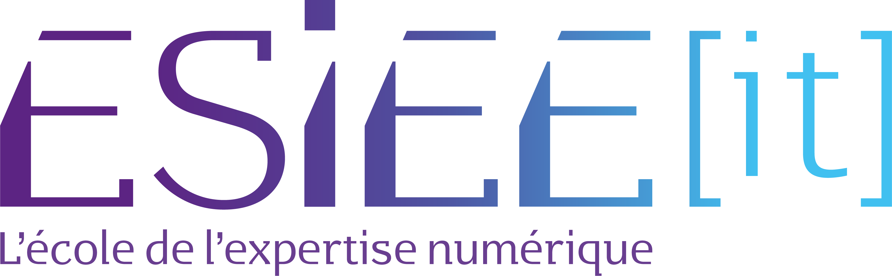

<a name="readme-top"></a>

[![Contributors][contributors-shield]][contributors-url]
[![Forks][forks-shield]][forks-url]
[![Stargazers][stars-shield]][stars-url]
[![Issues][issues-shield]][issues-url]
[![MIT License][license-shield]][license-url]


<!-- PROJECT LOGO -->
<br />
<div align="center">
  <a href="https://github.com/othneildrew/Best-README-Template">
    
  </a>

  <h3 align="center">✈️ Agence de voyage ✈️</h3>

  <p align="center">
    An awesome projects ! 🚀
    <br />
    <a href="https://github.com/othneildrew/Best-README-Template"><strong>Explore the docs 🛩️ »</strong></a>
    <br />
      
    <br />
    <a>Developped by </a><a href="https://github.com/Darkman-dev">Remy Madeira, </a><a href="https://github.com/Zerio113"> Gwendal pruny</a><a> for BTS SIO Slam <a href="">Esiee-IT</a> project.
    <br />
    <a href="https://github.com/othneildrew/Best-README-Template">View Demo 👁️</a>
    ·
    <a href="https://github.com/othneildrew/Best-README-Template/issues">Report Bug 🪳</a>
    ·
    <a href="https://github.com/othneildrew/Best-README-Template/issues">Request Feature 📋</a>
  </p>
</div>


<!-- TABLE OF CONTENTS -->
<details>
  <summary>Table of Contents </summary>
  <ol>
    <li>
      <a href="#about-the-project">About The Project</a>
      <ul>
        <li><a href="#built-with">Built With</a></li>
        <li><a href="#built-with">Cahier des charges</a></li>
        <li><a href="#built-with">Cahier technique</a></li>
      </ul>
    </li>
    <li>
      <a href="#getting-started">Getting Started</a>
      <ul>
        <li><a href="#prerequisites">Prerequisites</a></li>
        <li><a href="#installation">Installation</a></li>
      </ul>
    </li>
    <li><a href="#usage">Usage</a></li>
    <li><a href="#roadmap">Roadmap</a></li>
    <li><a href="#contributing">Contributing</a></li>
    <li><a href="#license">License</a></li>
    <li><a href="#contact">Contact</a></li>
    <li><a href="#acknowledgments">Acknowledgments</a></li>
  </ol>
</details>


<!-- ABOUT THE PROJECT -->
## About The Project 🖥️
---


### Projet StarrLuxx by brrr.Inc 🏢


Brrr.Inc a été engagé par une agence de voyage de luxe qui gère les jets privées, yatchs de luxes qui se nomme StarrLuxx. Elle effectue sa transition numérique et a besoin de nos compétence pour la création de leur application de gestion de déplacement et de location.

### Cahier des charges 📒


- [x]  Quelle est l'organisation ?
```
    StarrLuxx est une agence de luxe mondialement
    connu pour ses services de transports et de 
    location.
```

- [ ]  Quelle est la solution qu'elle attend (fonctionnalités) et elle sera utilisée par qui ?

``` 
L'entreprise souhaite avoir a sa disposition une application simple et facile a utiliser pour tracer les véhicules loués et monitorer les déplacement
```

- [ ] Utilisateurs de l'application :
```
    Pilote d'avion 🛩️
    Hotesse d'accueil 👩‍✈️
    Ingénieur de véhicules 🛠️
    Manager 👩‍💼
    Batelier 🚢
```

- [ ]  Fonctionnalités des acteurs du système :

  **👩‍✈️ Hotesse d'accueil :**
    ```    
        Gerer le voyage du voyageur
        louer les vehicules
        localiser les vehicules loués
    ```   

  **🛩️ Pilote d'avion :**

  ```    
      Voir les trajets qui lui on était assigné
      Voir le vehicule assigné
  ```  

  **🚢 Batelier :**

  ```    
      Voir les trajets qui lui on était assigné
      Voir le vehicule assigné
  ```  

  **🛠️ Ingénieur de véhicules :**

  ```    
    Voir le vehicule assigné
    Voir les problèmes désigné sur le vehicule
  ```  

  **👩‍💼 Manager :**

  ```    
      Voir les trajets qui on était assigné au batelier ou pilote
      Voir le vehicule assigné au batelier ou pilote
      Voir les problèmes désigné sur le vehicule au ingenieur
      Voir les voyages
      Voir les locations les vehicules
      Localiser les vehicules loués
  ```  

- [X]  Diagramme de cas d'utilisation


- [X]  Diagramme de classes métier


- [X]  BDD en sql 

[Base de données]()

- [ ]  Maquette des différents panels WIP -> Figma https://www.figma.com/files/project/77988298/Grrr.Inc?fuid=1192554199098374826

### Cahier technique 📙

- [ ]  ⚠ Contraintes techniques obligatoires :
```
  Langage utilisé : Java
  Framework de présentation : JavaFX
  Données : BDD SQL accessible sur Internet
  Gestion du code : via Git sur un projet dédié partagé sur GitHub.com
```

- [ ]  Rappel bref du contexte : read.me
- [ ]  Planification préliminaire du projet : Jira / Github
- [ ]  Contraintes techniques obligatoire et choisies (outils et langages utilisés + leur version) :
- [ ]  Modèle relationnel :
- [ ]  Organisation de votre code (quelles packages sont dédiés à quelles types de services rendus : exemple dao, vue, modele...) :
- [ ]  En annexe, ajouter le `Appli.sql` qui correspondra à une extraction de vos données régulièrement mis à jour !

### Built With 🧱

List of any major frameworks/libraries used to bootstrap our project.

* [![Bootstrap][Bootstrap.com]][Bootstrap-url]
* [![Java][java.com]][java-url]
* [![SQL][sql.com]][sql-url]
* [![Github][github.com]][github-url]

<p align="right">(<a href="#readme">back to top</a>)</p>

<!-- GETTING STARTED -->
## Getting Started 🎬
---

_Instructions to setting up our project locally.
To get a local copy up and running follow these simple example steps._

### Prerequisites 🤖
* Get Java and Java FX [https://example.com](https://example.com)

* npm
  ```sh
  npm install npm@latest -g
  ```

### Installation ↓

1. Get Java and Java FX [https://example.com](https://example.com)
2. Clone the repo
   ```sh
   git clone https://github.com/your_username_/Project-Name.git
   ```
3. Install NPM packages
   ```sh
   npm install
   ```
4. Enter your API in `config.js`
   ```js
   const API_KEY = 'ENTER YOUR API';
   ```

<p align="right">(<a href="#readme">back to top</a>)</p>

<!-- ROADMAP -->
## Roadmap 🛣️🏁
---

- JIRA WIP -> https://my-anime-list.atlassian.net/jira/software/projects/GI/boards/2/roadmap

_See the [open issues](https://github.com/Zerio113/Java-MyEasyLine-GR/issues) for a full list of proposed features (and known issues)._

<p align="right">(<a href="#readme">back to top</a>)</p>


<!-- CONTACT -->
## Contact 📇
---

Gwendal Pruny - [@Zerio113](https://github.com/Zerio113) - gwendal.pruny@edu.esiee-it.fr

Remy Madeira - [@Darkman](https://github.com/Darkman-dev) - remy.madeira@edu.esiee-it.fr

Project Link: [https://github.com/Zerio113/Java-MyEasyLine-GR](https://github.com/Zerio113/Java-MyEasyLine-GR)

<p align="right">(<a href="#readme">back to top</a>)</p>


[contributors-shield]: https://img.shields.io/github/contributors/othneildrew/Best-README-Template.svg?style=for-the-badge
[contributors-url]: https://github.com/othneildrew/Best-README-Template/graphs/contributors

[forks-shield]: https://img.shields.io/github/forks/othneildrew/Best-README-Template.svg?style=for-the-badge
[forks-url]: https://github.com/othneildrew/Best-README-Template/network/members

[stars-shield]: https://img.shields.io/github/stars/othneildrew/Best-README-Template.svg?style=for-the-badge
[stars-url]: https://github.com/othneildrew/Best-README-Template/stargazers

[issues-shield]: https://img.shields.io/github/issues/othneildrew/Best-README-Template.svg?style=for-the-badge
[issues-url]: https://github.com/othneildrew/Best-README-Template/issues

[license-shield]: https://img.shields.io/github/license/othneildrew/Best-README-Template.svg?style=for-the-badge
[license-url]: https://github.com/othneildrew/Best-README-Template/blob/master/LICENSE.txt

[linkedin-shield]: https://img.shields.io/badge/-LinkedIn-black.svg?style=for-the-badge&logo=linkedin&colorB=555
[linkedin-url]: https://linkedin.com/in/othneildrew

[product-screenshot]: images/screenshot.png

[Bootstrap.com]: https://img.shields.io/badge/Bootstrap-563D7C?style=for-the-badge&logo=bootstrap&logoColor=white
[Bootstrap-url]: https://getbootstrap.com

[JQuery.com]: https://img.shields.io/badge/jQuery-0769AD?style=for-the-badge&logo=jquery&logoColor=white
[JQuery-url]: https://jquery.com


[htlm.com]: https://img.shields.io/badge/HTML-239120?style=for-the-badge&logo=html5&logoColor=white
[html-url]: https://html.com

[css.com]: https://img.shields.io/badge/CSS-239120?&style=for-the-badge&logo=css3&logoColor=white
[css-url]: https://css.com

[js.com]: https://img.shields.io/badge/JavaScript-323330?style=for-the-badge&logo=javascript&logoColor=F7DF1E
[js-url]: https://js.com

[md.com]: https://img.shields.io/badge/Markdown-000000?style=for-the-badge&logo=markdown&logoColor=white
[md-url]: https://md.com

[java.com]: https://img.shields.io/badge/Java-ED8B00?style=for-the-badge&logo=java&logoColor=white
[java-url]: https://java.com

[sql.com]: https://img.shields.io/badge/mysql-%2300f.svg?style=for-the-badge&logo=mysql&logoColor=white
[sql-url]: https://sql.com

[github.com]: 	https://img.shields.io/badge/github-%23121011.svg?style=for-the-badge&logo=github&logoColor=white
[github-url]: https://github.com
